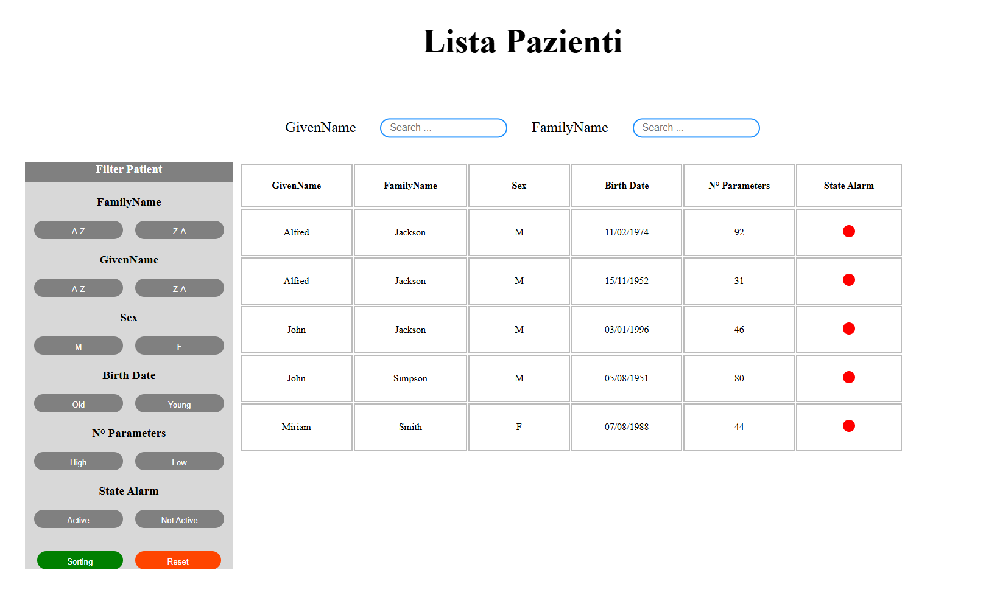

### SFIDA ASCOM 



## Indice

1. [Descrizione del Progetto](#descrizione-del-progetto)
2. [Struttura del Progetto](#struttura-del-progetto)
3. [Configurazione in Program.cs](#configurazione-in-programcs)
4. [Gestione delle API](#gestione-delle-api)
5. [Filtraggio e Ordinamento](#filtraggio-e-ordinamento)
6. [Tecnologie Usate](#tecnologie-usate)
7. [Run e Avvio](#run-e-avvio)
8. [More Info](#more-info)

## Descrizione del Progetto

Questo progetto consente di visualizzare i dati dei pazienti ottenuti tramite una **API** esterna. 
I dati vengono deserializzati e mostrati in una tabella dinamica, che può essere filtrata e ordinata.

### Creazione del progetto
- Il progetto è stato creato utilizzando **ASP.NET Core** con **Visual Studio Code 2022**.

### Struttura del Progetto
- **Controllers**: Gestisce la logica di navigazione e l'interazione con i modelli.
- **Models**: Contiene le classi per deserializzare i dati ottenuti dall'API.
- **Views**: Include le pagine Razor per la visualizzazione dei dati.

### Configurazione in `Program.cs`
Nel file `Program.cs`, ho configurato i seguenti servizi:
- `builder.Services.AddControllersWithViews();`
- `builder.Services.AddHttpClient<PatientService>();`
- `builder.Services.AddRazorPages();`

### Gestione delle API
Nel file **`/Models/GetIPAData.cs`**, ho creato il servizio `PatientService`.
1. #### **Costruttore**
    - consfiguro l'autenticazione per la richiesta API con `Authorization ` :
    ```csharp
         public PatientService(HttpClient httpClient)
        {
            _httpClient = httpClient;
            _httpClient.BaseAddress = new Uri("https://mobile.digistat.it/CandidateApi/");
            string user = "test";
            string password = "TestMePlease!";
            string authValue = Convert.ToBase64String(Encoding.ASCII.GetBytes($"{user}:{password}"));
            _httpClient.DefaultRequestHeaders.Authorization = new AuthenticationHeaderValue("Basic", authValue);
        }
    ```
2. #### **Funzione  `GetPatientsAsync()`**
    - La Funzione `GetPatientsAsync()` mi restituisce una lista di modelli `GetDataPatient`, che rappresentano i pazienti.
    - Inizializzazione del modello `Patients`, che conterrà tutti i pazienti.
    - Chiamata API effetuata tramite `GetAsync("Patient/GetList")`, e recupero i dati relativi ai pazienti.
    - Se la risposta API è positiva, i dati ottenuti vengono deserializzati.
    - Successivamente vengo fatti dei controlli su ogni paziente, per poi essere aggiunti alla lista del modello `Patients`.

### Filtraggio e Ordinamento
#### File **`Index.js`**
Questo file gestisce tutto il sistema di Filtraggio, Sort e Search ed eventi click.
1. #### **Gestione degli eventi dei Button**
2. #### **Funzione `GetDataPatient()`**
3. #### **Funzione `UpDateTablePatient(patientFilter)`**
4. #### **Funzione `FilterEndSortPatient()`**
5. #### **Funzione `ResetFilters()`**
6. #### **Funzione `SearchPatient()`**

### Tecnologie Usate
```
Framework: ASP.NET Core
Linguaggi: C#, JavaScript
Frontend: Razor Pages, HTML, CSS
Gestione API : HTTP Client
```

### Run e Avvio
```powershell
dotnet watch run
```

### More info
#### Perchè ho usato ASP.NET Core
Ho scelto di utilizzare ASP.NET Core per questo progetto perché da tempo 
desideravo approfondire questo framework. 
Inoltre, già utilizzavo C# con il motore di Unity. 
Questa opportunità mi ha permesso di esplorare ASP.NET Core e 
di soddifare la mia curiostà.